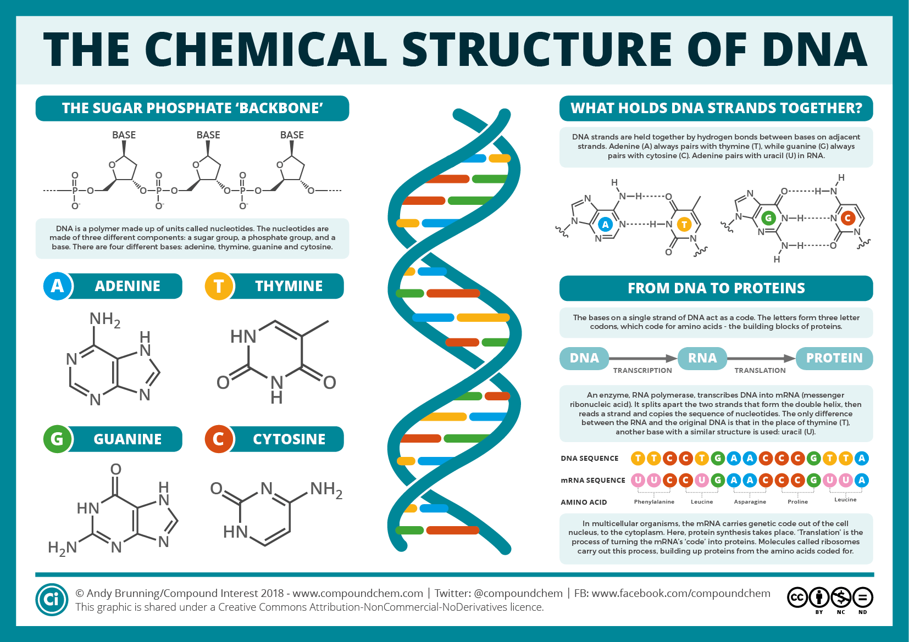

# DNA-to-RNA

Deoxyribonucleic acid, DNA is the primary information storage molecule in biological systems. It is composed of four nucleic acid bases Guanine ('G'), Cytosine ('C'), Adenine ('A'), and Thymine ('T').

Ribonucleic acid, RNA, is the primary messenger molecule in cells. RNA differs slightly from DNA its chemical structure and contains no Thymine. In RNA Thymine is replaced by another nucleic acid Uracil ('U').

 
This application accepts DNA strings of any length, searches for Thymine ('T') and replaces it with Uracial ('U') before returning an RNA string.
